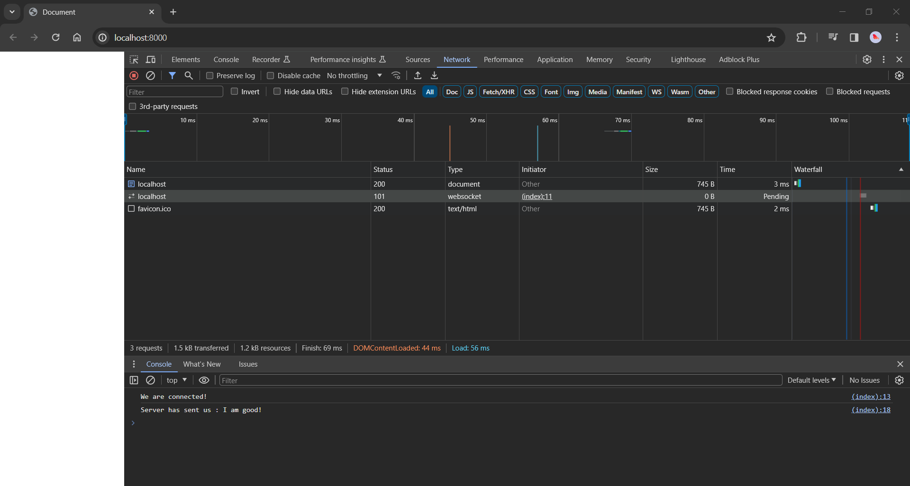
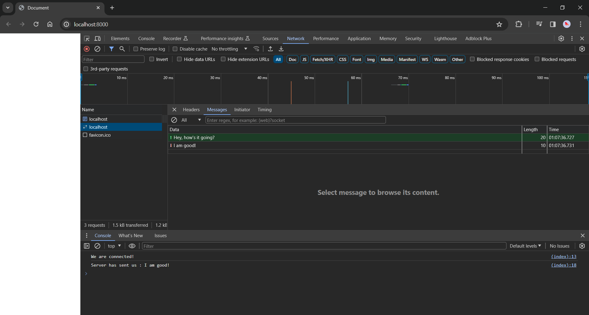

# websocket-test

### Quick start
1. Clone repository
2. Navigate to `client` and `server` directories in separate terminals
3. For both terminals, install dependencies and run `index.js`
    ```
    npm i
    ```
    ```
    node index.js
    ```

### Results
- Terminals in vscode
  <div><div>
- Network tab in browser
  <div><div>
- Websocket message
  <div><div>

### Reference 
- [How to use WebSockets - JavaScript Tutorial For Beginners](https://www.youtube.com/watch?v=FduLSXEHLng)